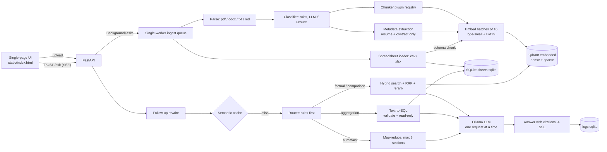

# DocMind

Fully local, CPU-only, multi-document RAG for an 8 GB laptop. No cloud APIs, no API keys, no Docker,
no OCR, no external binaries other than Python and [Ollama](https://ollama.com).
Models are downloaded **once**; afterwards the app works with the network disconnected.

## Architecture



## Quick start

Requires Python 3.11+, Git and [Ollama](https://ollama.com/download). About 4 GB of free disk for the
models and an internet connection for the one-time downloads.

```bash
git clone https://github.com/Srishti233/docmind.git && cd docmind
python3 -m venv .venv
source .venv/bin/activate            # Windows PowerShell: .venv\Scripts\Activate.ps1
pip install -r requirements.txt
pytest                               # optional sanity check, fully offline, a few seconds

ollama pull qwen2.5:3b-instruct      # one-time download
```

Recommended for an 8 GB machine: set these where `ollama serve` runs, before it starts
(Windows PowerShell: `$env:OLLAMA_MAX_LOADED_MODELS=1; $env:OLLAMA_NUM_PARALLEL=1`).
Skip `ollama serve` if Ollama already runs as a background service.

```bash
export OLLAMA_MAX_LOADED_MODELS=1 OLLAMA_NUM_PARALLEL=1
ollama serve
```

Start DocMind (any OS) and open http://127.0.0.1:8000:

```bash
uvicorn app.api.main:app --host 127.0.0.1 --port 8000
```

`GET /health` should report `"ollama": {"reachable": true, "model_available": true}`.
Optional settings can live in a `.env` file (copy `.env.example`); it is loaded automatically.

### First run (keep the internet on)

The first upload downloads the embedding, BM25 and reranker models (about 250 MB) into fastembed's
cache (`FASTEMBED_CACHE_PATH` relocates it). Afterwards everything works offline.

1. Drag everything in `samples/` into the page and wait until each document shows `done`
   (resume and contract take longer because of one LLM call for metadata).
2. Try these questions:
   * "How many days of paid annual leave do full-time employees get?" (policy, cited answer)
   * "What hourly fee does the Client pay the Contractor?" (contract)
   * "What is the total units sold per region?" (spreadsheet, text-to-SQL)
   * "Summarize hr_leave_policy.md" (map-reduce summary)
   * "What is the capital of Mars?" (should reply: I couldn't find this in the uploaded documents.)
3. Click a `[n]` citation to see the exact source passage.

### Configuration

All settings are optional environment variables (or `.env` entries); see `app/config.py` for the full list:

| Variable | Default | Meaning |
|---|---|---|
| `LLM_MODEL` | `qwen2.5:3b-instruct` | Ollama model (fallback `qwen2.5:1.5b-instruct`) |
| `EXTRACT_METADATA` | `true` | resume/contract metadata extraction (extra LLM call) |
| `RERANK_THRESHOLD` | `-3.0` | below this best score -> "I couldn't find this..." |
| `MAX_UPLOAD_MB` / `MAX_PDF_PAGES` | `25` / `500` | upload limits |
| `DOCMIND_DATA_DIR` | `./data` | uploads, Qdrant, SQLite files |
| `STORE_BACKEND` | `qdrant` | `memory` is for tests / smoke runs |

## How to add a document type

1. Add the name to `DOC_TYPES` in `app/ingest/classifier.py` and a rule table entry in `_RULES`.
2. Write one function in `app/ingest/chunkers.py`:

```python
@register("recipe")
def chunk_recipe(pages):                 # Iterable[Page] -> Iterator[Chunk]
    for page, line in iter_lines(pages):
        ...
        yield Chunk(text, page, "Ingredients")
```

Unknown types fall back to the paragraph-window chunker.

## Tests and evaluation

```bash
pytest                                   # fully offline: fake models, stub LLM, in-memory + real embedded Qdrant
python -m eval.run_eval                  # recall@4 + MRR: dense vs hybrid vs hybrid+rerank -> eval/results.md
python -m eval.run_eval --judge          # + local LLM-as-judge faithfulness (needs Ollama)
python -m eval.run_eval --fake           # smoke test of the harness only (numbers are meaningless)
python -m eval.make_golden --workspace default --n 12   # draft candidates for MANUAL review
```

No local machine? On GitHub open **Actions > eval > Run workflow**. It runs the real retrieval evaluation
(no Ollama needed) and publishes the table in the job summary and as the `eval-results` artifact.
It measures retrieval only; answer quality needs a local Ollama run.

## Design decisions

* **FastAPI + one static page**: no Node/build step; SSE works over plain `fetch`.
* **Ollama + qwen2.5:3b-instruct**: best quality that fits 8 GB next to the app on CPU; 1.5B is the documented fallback. Every call goes through `app/llm/client.py` (stream, JSON mode, one-at-a-time lock).
* **fastembed (ONNX) for dense, BM25 and reranker**: no PyTorch, small RAM footprint, CPU-friendly, one library for three jobs.
* **Embedded Qdrant**: dense + sparse vectors and payload filters on disk with no server. Fusion is done by our own `rrf_fuse` (testable, lets the eval compare modes).
* **Rules-first classifier/router**: LLM calls cost seconds on CPU, so rules decide and the LLM only breaks ties.
* **Parent-child for policies**: search small chunks (precise), give the LLM the parent section (context).
* **Spreadsheets in SQLite, rows never embedded**: aggregation needs exact arithmetic. Only a schema description is embedded so the file is discoverable.
* **Text-to-SQL defence in depth**: textual validator (one SELECT, no comments/quotes/CTE/UNION, table allow-list per workspace) + SQLite authorizer + read-only connection + row limit + timeout.
* **Prompt-injection defence**: delimiters, system prompt marking sources as untrusted, delimiter neutralisation, a detector that flags instruction-like chunks (shown with a warning in the UI).
* **Concurrency**: a process-wide lock guarantees one LLM request at a time (a threading lock because ingestion runs in a worker thread); the API also wraps `/ask` in `asyncio.Semaphore(1)` so waiting requests do not hold threads.
* **Memory**: pages stream from parsers, chunkers are generators, embedding is batched by 16, uploads stream to disk, models are lazy singletons, semantic cache capped at 200.

## Performance notes (estimates, not measurements)

On a typical 4-8 core laptop CPU with the 3B model (Q4): first token roughly 3-8 s, then about 4-8 tokens/s,
so a 150-token answer takes ~25-40 s. Retrieval (embed + BM25 + rerank 20) is typically under 1 s.
Ingesting a 10-page text PDF takes seconds; resumes/contracts add one ~5-15 s LLM call for metadata.
The first request after idle (>10 min) reloads the model (+10-20 s).
**Switch to the 1.5B model** for roughly 2x speed at lower answer quality:

```bash
ollama pull qwen2.5:1.5b-instruct
export LLM_MODEL=qwen2.5:1.5b-instruct
```

Check `/health` for live RSS memory, loaded models and Ollama status.

## Known limitations

* No OCR: scanned PDFs fail with a clear error.
* Text-to-SQL allows exactly one SELECT: no subqueries/CTEs/UNION, so some "above average" questions cannot be answered.
* Summaries of very long documents use the first ~3,200 characters of each of at most 8 sections.
* PDF text extraction quality depends on the PDF; multi-column layouts may interleave.
* Cross-encoder score thresholds are corpus-dependent; tune `RERANK_THRESHOLD` using `eval.run_eval`.
* Semantic cache and conversation memory are in-process and reset on restart.
* Single user / single machine by design (embedded Qdrant allows one process).

## Troubleshooting

| Symptom | Fix |
|---|---|
| "Ollama is not running" | run `ollama serve` |
| "Model not available ... ollama pull" | `ollama pull qwen2.5:3b-instruct` |
| Too slow or out of memory | set `LLM_MODEL=qwen2.5:1.5b-instruct` (and `ollama pull` it) |
| Good questions return "couldn't find this" | lower `RERANK_THRESHOLD` (for example `-5`) |
| Scanned PDF fails | expected: OCR is out of scope |
| Qdrant "already accessed by another instance" | run only one DocMind process per data directory |
| Log warns the index "was built without the BM25 IDF modifier" | delete `data/qdrant` and re-upload (index from an older version) |

## More

* CI: `.github/workflows/ci.yml` runs the offline test suite on Python 3.11 and 3.13 for every push;
  `.github/workflows/eval.yml` is a manual job for the real retrieval evaluation.
* License: MIT (see `LICENSE`; put your own name in the copyright line).
